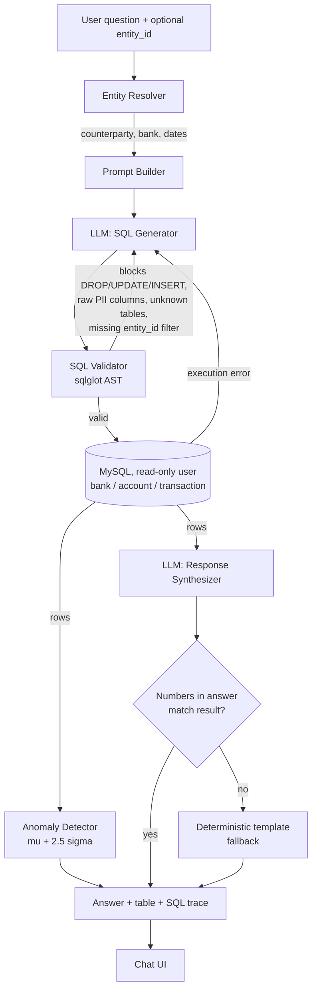

# FinQuery AI — Bank Transaction Assistant

A conversational assistant that answers plain-English questions about bank transaction data (spend, balances, reconciliation) with every number grounded in a real SQL query result — never invented by the model.

Built for the TBX / BVP Tech Catalyst Hackathon — "Build a Finance Assistant That Actually Understands You."

## Why this architecture

The core risk in this problem is a model that produces a plausible-sounding but wrong number. So the LLM is never allowed to do arithmetic: it only (1) translates a question into SQL, and (2) narrates an already-computed result. Every number that reaches the user is verified against the real query result before being shown.



Key decisions this makes concrete:

- **MySQL, not an embedded file DB**: matches the client's own DDL (`ENGINE=InnoDB`, `ENUM('credit','debit')`, etc.) verbatim in `db/schema.sql`. Every component reads connection details from `core/db_connection.py` (in turn from `config.py`/`.env`) — swapping to a different MySQL instance means editing `.env`, not code.
- **Read-only enforced at the database level, not just in code**: query execution always connects as a dedicated `finquery_ro` MySQL user with `GRANT SELECT` only — a real permission boundary, on top of (not instead of) the SQL-validator's SELECT-only check.
- **Grounded retrieval & accurate computation**: SQL generation is steered toward pre-aggregated views (`v_counterparty_spend_summary`) instead of ad hoc joins, to avoid join fan-out silently double-counting a sum. All math (`SUM`, `COUNT`, `AVG`) happens in MySQL, never in the model.
- **Verifiable answers**: every response pairs the plain-language answer with the backing rows and the exact executed SQL (collapsible "SQL Lineage & Audit Trace" panel in the UI).
- **Hallucination guardrail, enforced not just prompted**: `core/response_synthesizer.py` extracts every number the LLM states and checks it against the real result set. A mismatch replaces the LLM's prose with a deterministic template — this is a code-level check, not a prompt instruction the model could ignore.
- **PII is masked by default**: `account_number` and `utr_number` are never selectable raw (blocked by `core/sql_validator.py`'s AST check) and are masked a second time, unconditionally, at the query-execution layer as defense in depth — see `core/query_engine.py`. Masked account numbers show the real last 4 digits with the rest replaced by `*` (`CONCAT('******', RIGHT(account_number, 4))`).
- **No login, so an entity (customer) selector stands in for it**: a customer (`entity_id`) can genuinely own several accounts, often at different banks (the sample data models this deliberately — see `scripts/generate_sample_data.py`). The UI's "Customer" dropdown (`/api/entities`) scopes questions to one entity; this is enforced by both a prompt instruction and a post-generation check that the SQL actually filters by the selected `entity_id` — **this is a usability scope, not a security boundary** (out of scope per the problem statement: no auth, no per-customer DB permissions).
- **No vendor master table in the real schema** — the client's real data (`bank` / `account` / `transaction`) has no clean vendor list, only free-text bank narration (NEFT/IMPS/UPI/FT formats). `core/description_parser.py` extracts a best-effort counterparty name deterministically (never an LLM guess), with an honest confidence level, and always keeps the raw description alongside so nothing is silently guessed.
- **"Unreconciled" is a labeled proxy, not invented status**: the real schema has no reconciliation table, so `reconciliation_proxy_status` is derived from presence of a reference ID or UTR — the prompt and the report are explicit that this is a heuristic, not a certified accounting status.
- **Confidence signaling tied to real signals**: the confidence badge reflects actual fuzzy-match quality, retry count, and whether the numeric-grounding check passed — not an arbitrary number.

## Setup

Requires Python 3.11+ and a MySQL 8 server.

**Don't have one?** Spin one up with Docker in about 30 seconds:
```bash
docker run -d --name hack_tbx_mysql \
  -e MYSQL_ROOT_PASSWORD=root_pw \
  -e MYSQL_DATABASE=finquery \
  -e MYSQL_USER=finquery_app -e MYSQL_PASSWORD=app_pw \
  -p 3306:3306 -v hack_tbx_mysql_data:/var/lib/mysql \
  mysql:8.0
# then create the read-only runtime user:
docker exec -i hack_tbx_mysql mysql -uroot -proot_pw <<'EOF'
CREATE USER 'finquery_ro'@'%' IDENTIFIED BY 'ro_pw';
GRANT SELECT ON finquery.* TO 'finquery_ro'@'%';
FLUSH PRIVILEGES;
EOF
```

Then:
```bash
pip install -r requirements.txt
cp .env.example .env   # fill in DB_* credentials (see above) and an LLM API key below
python db/init_db.py   # creates schema + loads sample_data/*.csv into MySQL
python run.py           # starts the API + UI at http://localhost:8000
```

`run.py` auto-initializes the schema on first run if it's missing, so this also works as just `pip install -r requirements.txt && python run.py` once `.env` points at a reachable MySQL server.

### Database connection

All of it lives in `.env` (read by `core/db_connection.py` via `config.py`) — nothing else hardcodes a connection:

| Var | Purpose |
|---|---|
| `DB_HOST`, `DB_PORT`, `DB_NAME` | Where the MySQL server is |
| `DB_ADMIN_USER` / `DB_ADMIN_PASSWORD` | Full-privilege user — used only by `db/init_db.py` |
| `DB_READONLY_USER` / `DB_READONLY_PASSWORD` | `GRANT SELECT`-only user — used by every query the app actually runs |

### LLM provider

Set `LLM_PROVIDER` in `.env` to one of:

| Provider | Env vars needed | Notes |
|---|---|---|
| `openrouter` (default) | `OPENROUTER_API_KEY`, `OPENROUTER_MODEL` | Access to many hosted models; a free-tier model's shared rate limit can be tight under sustained use — see `MODEL_EFFICIENCY_REPORT.md` |
| `groq` | `GROQ_API_KEY` | Very fast, generous free tier — good fallback for a live demo if the OpenRouter tier throttles |
| `ollama` | `OLLAMA_BASE_URL` (local) | Zero API cost, runs entirely offline |
| `openai` | `OPENAI_API_KEY` | Any OpenAI-compatible model |

### Using your own data

Replace `sample_data/bank.csv`, `sample_data/account.csv`, `sample_data/transaction.csv` with a real export matching the schema in `db/schema.sql` (identical column names/types to the client's DDL), then re-run `python db/init_db.py`. It re-derives `transaction_derived` (counterparty/rail extraction) automatically — no manual step needed. The current `sample_data/` is synthetic, generated by `scripts/generate_sample_data.py` to match the real narration formats and scale (~450 transactions; the schema and pipeline don't need re-architecting whether the real data is hundreds or tens of thousands of rows).

## Using it

Visit `http://localhost:8000`. Pick a customer from the "Customer" dropdown (top-left) to scope questions to one entity — several have accounts at 2+ banks on purpose, to exercise that case — or leave it on "All customers" to query everything. Try the suggested question chips, or ask your own — e.g. "How much did we send to Amazon Retail India this quarter?", "Show unreconciled transactions over 50000", "What's our balance at HDFC Bank?". Ask a follow-up like "and last month?" to see multi-turn context reuse. Try the "unknown counterparty" chip to see the honest refusal path.

## Testing & benchmarking

```bash
python test_pipeline.py                    # component tests: parser, resolver, validator, engine, + live pipeline
python test_pipeline.py --component parser  # any single component
python test_pipeline.py --interactive       # REPL to try questions ad hoc

python benchmark.py --dry-run               # fast structural/guardrail check, no LLM calls
python benchmark.py                         # full gold-set run against the configured model
python benchmark.py --with-synthesis        # + the narration step, for full end-to-end cost/latency
```

`benchmark.py` writes `MODEL_EFFICIENCY_REPORT.md` (measured tokens/cost/latency/accuracy — the model-choice + efficiency write-up) and `benchmark_results.json` (raw per-query data).

## Out of scope (per the problem statement)

Live banking/ERP integration, multi-tenant auth/user roles, and answering every conceivable financial question — the assistant covers spend, balances, and reconciliation-proxy questions over the given schema.
